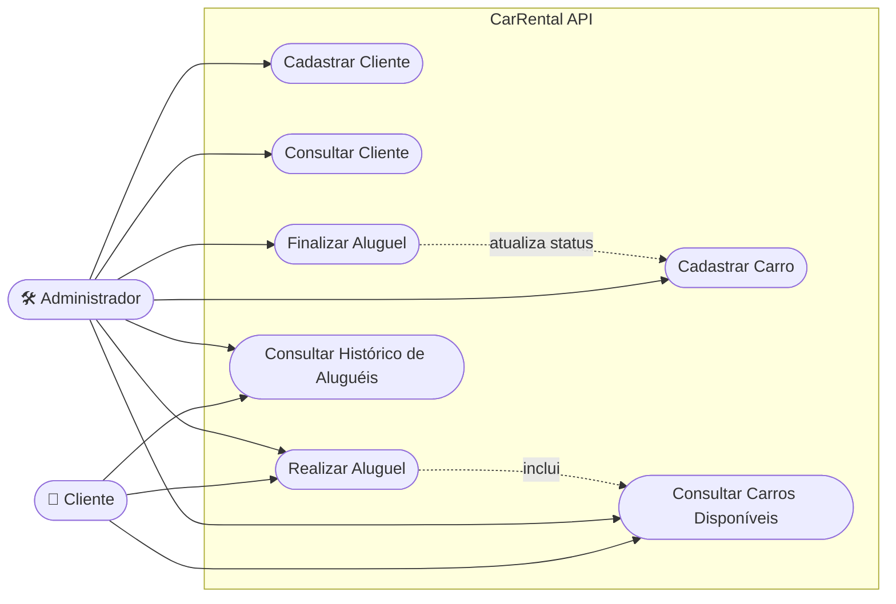

# Diagrama de Casos de Uso — CarRental API

## Atores

| Ator | Descrição |
|------|-----------|
| **Cliente** | Pessoa física que deseja alugar um veículo no sistema |
| **Administrador** | Funcionário/operador responsável pelo gerenciamento do sistema |

## Casos de Uso

| ID | Caso de Uso | Ator Principal | Descrição |
|----|-------------|----------------|-----------|
| UC01 | Cadastrar Cliente | Administrador | Registra um novo cliente com dados pessoais (nome, CPF, telefone, email, endereço) |
| UC02 | Consultar Cliente | Administrador | Busca dados de um cliente cadastrado pelo CPF ou ID |
| UC03 | Cadastrar Carro | Administrador | Registra um novo veículo com modelo, placa, categoria, valor da diária e status |
| UC04 | Consultar Carros Disponíveis | Cliente / Administrador | Lista todos os veículos com status disponível para locação |
| UC05 | Realizar Aluguel | Cliente / Administrador | Cria um novo aluguel associando um cliente a um carro disponível, registrando data de retirada e prevista de devolução |
| UC06 | Finalizar Aluguel | Administrador | Registra a devolução do veículo, calcula o valor total e atualiza o status do carro para disponível |
| UC07 | Consultar Histórico de Aluguéis | Cliente / Administrador | Lista todos os aluguéis realizados, filtrando por cliente ou período |

## Diagrama Mermaid

> Mermaid não possui um tipo nativo de "diagrama de caso de uso" (isso é específico do PlantUML). A representação abaixo usa `flowchart`, que é suportado nativamente pelo GitHub, simulando atores (retângulos) conectados a casos de uso (formato de estádio/elipse).

> **Nota:** O caso de uso *Realizar Aluguel* inclui a verificação de disponibilidade do carro (UC04), e o caso *Finalizar Aluguel* atualiza o status do veículo para disponível (relação com UC03).